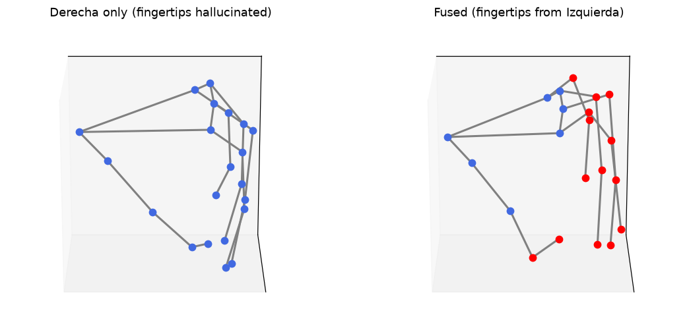

# HandPose — two-view 3D hand reconstruction

Markerless 3D hand tracking of grasp trials filmed with **two phone cameras**.
Single-view MediaPipe hand tracking hallucinates the fingers that the object
occludes; a second viewpoint recovers them.

The repo covers two routes to that second viewpoint:

- **Calibration-free fusion** *(implemented, and what produced the results
  below)* — uses the palm as its own reference frame, so it needs no camera
  calibration at all. Accurate to ~0.75 cm.
- **ChArUco calibration → metric triangulation** *(board generator + full
  written guide; triangulation delegated to Pose2Sim/Anipose)* — the higher-
  accuracy route, for when relative-scale 3D is not good enough. See
  [Calibration](#calibration-route-to-metric-3d).



*Left: primary view alone — the fingertips wrapped around the cylinder are guessed.
Right: fused — those joints (red) come from the second camera.*

## The naming, up front

`Derecha` / `Izquierda` in every filename refer to the **camera position**
(right-hand / left-hand side of the scene), **not** to which hand is being
recorded. Both views film the same hand doing the same grasp. `Derecha` is the
*primary* view (its reference frame is kept); `Izquierda` is the *secondary*
view (donates the occluded joints). The two `vista 2` files in the raw video set
are an unrelated one-off take and are not part of any pair.

## How it works

The two cameras are never calibrated. Instead, per frame:

1. **Sync** — cross-correlate the two audio tracks to get the time offset
   between the recordings (`sync_audio.py`). A sharp correlation peak also
   confirms the takes really are simultaneous.
2. **Track** — run MediaPipe HandLandmarker on each view independently,
   producing 21 landmarks per frame in normalized, pixel, and metric-world
   coordinates (`hand_pose.py`).
3. **Align** — MediaPipe's world landmarks are already metric but expressed in
   each camera's own frame. The **palm and knuckles are visible in both views**,
   so a Kabsch (similarity) fit on those 7 anchors recovers the rotation, scale,
   and translation between the two hand frames — one fit per frame, no board,
   no intrinsics (`fuse_views.py`).
4. **Fill** — the 14 distal joints occluded in the primary view are replaced by
   the secondary view's, mapped through that transform, but only when the anchor
   residual is below `--max-resid` (default 2 cm), so a bad frame is skipped
   rather than fused wrongly.
5. **Measure & inspect** — grasp aperture, per-finger flexion, and fingertip
   spread over time (`grasp_metrics.py`); a 3D skeleton video; and a 2D overlay
   back onto the primary footage, projected through a per-frame affine camera
   fit from the primary view's own world↔pixel correspondences (`overlay_fill.py`).

Measured on the Cilindrico pair, the palm-anchor fit residual is **0.75 cm median**
(~8 % of palm span) across 323 synced frame pairs — that is the practical accuracy
limit of this uncalibrated approach (`align_probe.py` reports it for any pair).

## Results

Six grasp types, both views, fully automatic:

| Grasp | Sync confidence | Offset (s) | Frames fused | Occluded joints recovered |
|---|---|---|---|---|
| Cilindrico   |  8.6 | +0.472 | 496 | 43.4 % |
| Disco        |  8.6 | +0.615 | 538 | 39.5 % |
| Esferico     |  9.2 | +0.342 | 545 | 45.6 % |
| Pinch        |  8.7 | +1.803 | 604 | 46.5 % |
| Plano        |  7.2 | −0.394 | 730 | 50.0 % |
| SelfieStick  | 10.1 | +0.245 | 564 | 44.0 % |

Sync confidence is the correlation peak over its 99th-percentile baseline;
anything above ~5 is a clean match. "Joints recovered" is the share of all
landmark rows that came from the second view rather than being guessed by the
primary.

## Calibration route to metric 3D

The fusion above deliberately avoids calibration — it buys robustness (nothing to
set up, cameras can be any two phones) at the cost of scale that is only as good
as MediaPipe's own world-landmark estimate. Calibrating the pair properly replaces
the palm-anchor fit with real triangulation: every point seen by both cameras is
reconstructed in true millimetres.

That route is documented end to end in
[`docs/Tutorial_Calibracion.md`](docs/Tutorial_Calibracion.md) (Spanish, with
diagrams) — what intrinsics, extrinsics, and temporal sync each mean; how to shoot
a usable ChArUco video and the mistakes that ruin one; and three ways to compute
the calibration (Pose2Sim, Anipose, or OpenCV by hand).

```bash
python generar_charuco.py    # -> docs/charuco_board.png, printable A4 5x7 board
```

**Print it at 100 % scale, then measure a printed square with a ruler and correct
`SQUARE_LEN` in `generar_charuco.py`** — that measurement is what makes the output
metric, and printer scaling is the usual source of a silently wrong scale factor.

Status: the board generator and the guide are here; the triangulation itself is
delegated to Pose2Sim or Anipose rather than reimplemented. The one piece still
missing to connect them is a converter that writes the `x_px,y_px` columns
`hand_pose.py` already exports into the per-frame OpenPose-style JSON Pose2Sim
expects. `sync_audio.py` already covers the temporal-sync step for the calibration
footage too.

## Setup

```bash
conda create -n handpose python=3.11
conda activate handpose
pip install -r requirements.txt
./get_model.sh          # downloads hand_landmarker.task (~7.5 MB)
```

`ffmpeg` must be on PATH — `sync_audio.py` shells out to it to extract audio.

## Data layout

Raw video and all rendered results are **not in this repo** (~900 MB); the
`.gitignore` keeps them out. Recreate the layout locally:

```
Videos Cinves/                  # raw footage, one pair per grasp
  Cilíndrico_Derecha.mp4        #   primary view
  Cilíndrico_Izquierda.mp4      #   secondary view
  ...
hand_landmarker.task            # from ./get_model.sh
out/<Grasp>/                    # everything below is generated
  der.csv  izq.csv              #   per-view landmarks
  sync.json                     #   audio offset + confidence
  fused.csv                     #   fused 3D, with a per-point `source` column
  fused_3d.mp4  overlay.mp4     #   3D skeleton / 2D overlay renders
  metrics.csv  metrics.png      #   aperture, flexion, spread
```

## Usage

Everything, for every grasp pair:

```bash
python batch_all.py             # sync -> track both views -> fuse   (add --force to redo)
python batch_metrics_overlay.py # metrics + 2D overlay for each grasp
```

Or one stage at a time:

```bash
# single view -> landmarks (+ annotated video unless --no-video)
python hand_pose.py "Videos Cinves/Pinch_Derecha.mp4" --csv out/Pinch/der.csv --no-video

# time offset between the two recordings
python sync_audio.py "Videos Cinves/Pinch_Derecha.mp4" "Videos Cinves/Pinch_Izquierda.mp4" \
    --json out/Pinch/sync.json

# fuse the two views into one 3D skeleton
python fuse_views.py --primary out/Pinch/der.csv --primary-fps 30 \
    --secondary out/Pinch/izq.csv \
    --secondary-video "Videos Cinves/Pinch_Izquierda.mp4" \
    --offset 1.803 --out-csv out/Pinch/fused.csv --out-video out/Pinch/fused_3d.mp4

# grasp metrics + plot
python grasp_metrics.py out/Pinch/fused.csv --fps 30 --out-prefix out/Pinch/metrics

# draw the fused skeleton back onto the primary footage (red = recovered)
python overlay_fill.py --video "Videos Cinves/Pinch_Derecha.mp4" \
    --primary-csv out/Pinch/der.csv --fused-csv out/Pinch/fused.csv \
    --out out/Pinch/overlay.mp4
```

## Scripts

| Script | Purpose |
|---|---|
| `hand_pose.py` | MediaPipe HandLandmarker on one video → landmark CSV + annotated video |
| `sync_audio.py` | Audio cross-correlation → time offset + sync confidence |
| `fuse_views.py` | Kabsch palm alignment → fused 3D CSV + 3D skeleton video |
| `grasp_metrics.py` | Aperture, per-finger flexion, fingertip spread → CSV + plot |
| `overlay_fill.py` | Projects the fused 3D back onto the primary video |
| `batch_all.py` | Runs sync → track → fuse for all six grasp pairs |
| `batch_metrics_overlay.py` | Runs metrics + overlay for everything already in `out/` |
| `align_probe.py` | Diagnostic: how well do the two views actually align? |
| `compare_fill.py` | Renders the primary-only vs fused figure above |
| `generar_charuco.py` | Generates the printable ChArUco board for calibration |
| `make_diagrams.py` | Rebuilds the tutorial's vector diagrams |

The diagnostic and figure scripts (`align_probe.py`, `compare_fill.py`) default
to `out/Cilindrico/`; change `GRASP` at the top to point them elsewhere.

## Docs

- [`docs/Tutorial_Calibracion.md`](docs/Tutorial_Calibracion.md) — calibration
  tutorial: what intrinsics/extrinsics are, how to shoot the ChArUco video, and
  how to get real metric 3D via Pose2Sim or Anipose (Spanish, with diagrams).
- `docs/tutorial.html`, `docs/Tutorial_Calibracion.pdf` — rendered versions.
- `docs/charuco_board.png` — printable A4 board (see
  [Calibration](#calibration-route-to-metric-3d)).
